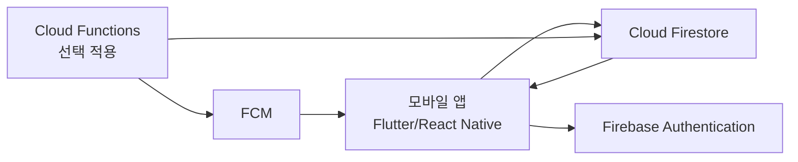

# 패밀리톡 기획서 (6월)

## 1. 프로젝트 개요
- 프로젝트명: 패밀리톡
- 한 줄 소개: 가족의 일정, 식단, 감정 상태를 한 화면에서 공유해 가족 간 소통을 돕는 모바일 커뮤니케이션 앱
- 추진 배경: 가족 구성원들의 바쁜 생활 패턴으로 대화와 정보 공유가 줄어들며 일정 충돌, 오해, 갈등이 발생

## 2. 문제 정의
- 가족 구성원 간 일정 공유가 실시간으로 되지 않아 중요한 약속, 행사, 준비사항이 누락됨
- 식사 관련 정보(오늘의 식단, 외식 여부, 장보기 필요 등)가 분산되어 불필요한 반복 대화 발생
- 가족 구성원의 감정/컨디션을 미리 파악하기 어려워 불필요한 감정 충돌이 생김

## 3. 프로젝트 목표
- 가족 구성원 전체가 오늘의 주요 일정과 가족 행사를 빠르게 확인할 수 있도록 함
- 식단 및 상태 정보를 간단히 공유해 일상 대화 비용을 줄임
- 감정/컨디션 표시 기능으로 서로의 상태를 이해하고 배려하는 소통 환경 조성

## 4. 기대 효과
- 개인 일정과 가족 행사 공유로 시간 관리 효율 향상
- 사전 정보 공유를 통해 일정 충돌과 커뮤니케이션 누락 감소
- 가족 간 공감 형성 및 의견 충돌 완화

## 5. 타깃 사용자 및 페르소나
### 5.1 타깃 사용자
- 맞벌이 가정
- 자녀가 있는 3~5인 가족
- 일정이 바쁘고 가족 간 소통 시간이 제한적인 사용자

### 5.2 대표 페르소나
- 이름: 김OO (40대, 직장인 아버지)
- 상황: 출퇴근 및 업무로 바빠 가족과 실시간 대화가 어려움
- 니즈:
	- 가족 일정을 한눈에 확인하고 싶음
	- 중요한 가족 행사/학교 일정 누락을 줄이고 싶음
	- 가족의 컨디션을 미리 파악해 갈등을 줄이고 싶음

## 6. 핵심 기능 정의
### 6.1 가족 일정 공유
- 개인 일정 등록/수정/삭제
- 가족 공용 일정(행사, 병원, 학교 이벤트) 등록
- 오늘 일정 우선 노출

### 6.2 오늘의 식단 공유
- 오늘의 식단 입력 및 확인
- 식사 준비 상태(완료/예정/외식) 표시

### 6.3 감정/컨디션 아이콘 표시
- 사용자별 감정/컨디션 아이콘 선택 (예: 기쁨, 피곤, 아픔, 보통)
- 당일 상태를 홈 화면에서 즉시 확인

### 6.4 가족 의견 투표
- 간단한 주제 생성 (예: 주말 외식 장소)
- 다중 선택지 투표 및 결과 확인

### 6.5 가족 구성원 정보 확인
- 가족 구성원 목록 및 기본 프로필 확인
- 상태(온라인 여부, 오늘 상태) 요약 제공

## 7. 핵심 화면 구성
### 7.1 홈 화면
- 오늘의 일정 카드
- 오늘의 식단 카드
- 가족 구성원 감정/컨디션 아이콘

### 7.2 일정 화면
- 캘린더/리스트 기반 일정 확인
- 개인 일정과 가족 행사 구분 표시

### 7.3 투표 화면
- 투표 주제 목록
- 항목 선택 및 결과 확인

### 7.4 가족 화면
- 가족 구성원 목록
- 프로필 및 상태 정보

## 8. 사용자 시나리오
1. 사용자는 출근 전 홈 화면에서 오늘의 가족 일정을 확인한다.
2. 점심시간에 저녁 식단 정보를 확인하고, 필요 시 장보기 메모를 남긴다.
3. 퇴근 전 본인의 컨디션 아이콘을 "피곤"으로 설정해 가족에게 상태를 공유한다.
4. 주말 계획을 위해 투표 기능으로 외식 장소를 결정한다.

## 9. MVP 범위
### 9.1 포함 (In Scope)
- 가족 일정 등록/조회
- 오늘의 식단 공유
- 감정/컨디션 아이콘 표시
- 간단 투표 기능

### 9.2 제외 (Out of Scope)
- 실시간 음성/영상 통화
- 외부 캘린더(구글/애플) 연동
- 고급 통계 리포트

## 10. 개발 일정 (6월, 총 8시간)
- 1단계 (2시간): 기획서 작성 및 요구사항 확정
- 2단계 (2시간): 기능 상세 정의 및 우선순위 정리
- 3단계 (2시간): 화면 구조 설계 (와이어프레임)
- 4단계 (2시간): 최종 점검 및 보완

## 11. 기술 스택 (제안)
- 프론트엔드: Flutter 또는 React Native
- 백엔드: Firebase (Authentication, Firestore)
- 알림: Firebase Cloud Messaging
- 디자인/협업: Figma, GitHub

## 12. 시스템 아키텍처 (MVP)
### 12.1 아키텍처 개요
- 앱 클라이언트(Flutter/React Native)와 Firebase 기반 BaaS를 중심으로 한 서버리스 구조
- 인증은 Firebase Authentication, 데이터 저장은 Firestore, 푸시 알림은 FCM 사용
- 초기 MVP에서는 별도 전용 백엔드 서버 없이 빠른 개발/운영을 목표로 구성

### 12.2 구성 요소
- 클라이언트 앱
	- 홈/일정/투표/가족 화면 렌더링
	- 상태 변경(일정 등록, 감정 아이콘 변경, 투표 참여) 요청 전송
- Firebase Authentication
	- 이메일/소셜 로그인 처리
	- 가족 그룹 접근 제어를 위한 사용자 식별
- Cloud Firestore
	- 가족, 일정, 식단, 감정 상태, 투표 데이터 저장
	- 실시간 동기화로 가족 구성원 화면 동시 반영
- Firebase Cloud Messaging (FCM)
	- 일정 알림, 투표 생성 알림, 상태 변경 알림 푸시 발송

### 12.3 논리 아키텍처 다이어그램

### 12.4 핵심 데이터 흐름
1. 사용자가 로그인하면 Authentication에서 토큰을 발급받아 앱 세션을 유지한다.
2. 사용자가 일정/식단/감정/투표 데이터를 등록하면 Firestore에 저장된다.
3. 같은 가족 그룹 사용자는 Firestore 실시간 구독으로 변경 사항을 즉시 반영받는다.
4. 주요 이벤트(다가오는 일정, 새 투표 생성)는 FCM 푸시로 안내한다.

### 12.5 확장 고려사항
- 트래픽 증가 시 Cloud Functions를 도입해 알림 트리거, 검증 로직, 집계 처리 분리
- 외부 캘린더 연동 시 API Gateway + 서버 함수 계층 추가
- 민감 데이터 증가 시 필드 단위 암호화 및 접근 로그 강화

## 13. 보안 및 개인정보 고려사항
- 가족 초대 기반 폐쇄형 그룹 구조 적용
- 로그인 인증(이메일/소셜) 및 사용자 권한 분리
- 개인정보 최소 수집 원칙 준수
- 일정/상태 데이터 전송 시 HTTPS 적용

## 14. 디자인 방향
- 목표 스타일: 카카오톡처럼 직관적이고 친숙한 UI
- 핵심 원칙:
	- 큰 텍스트 대비와 명확한 정보 계층
	- 아이콘 중심의 빠른 상태 인지
	- 탭 3~4개 내에서 주요 기능 접근 가능
	- 연령대가 다양한 가족을 고려한 단순한 인터랙션

## 15. 성공 지표 (초기)
- 주 3회 이상 가족 일정 확인 사용자 비율
- 감정/컨디션 아이콘 주간 업데이트율
- 투표 기능 사용 횟수
- 사용자 피드백 기준 "가족 소통에 도움" 응답 비율

## 16. 향후 확장 아이디어
- 학교/회사 캘린더 자동 연동
- 가족 기념일 자동 추천 및 리마인드
- 가족별 맞춤 대시보드(자녀 일정 중심, 부모 일정 중심)

---

본 문서는 패밀리톡 MVP 개발을 위한 1차 기획서이며, 추후 사용자 인터뷰 및 테스트 결과를 반영해 업데이트한다.
